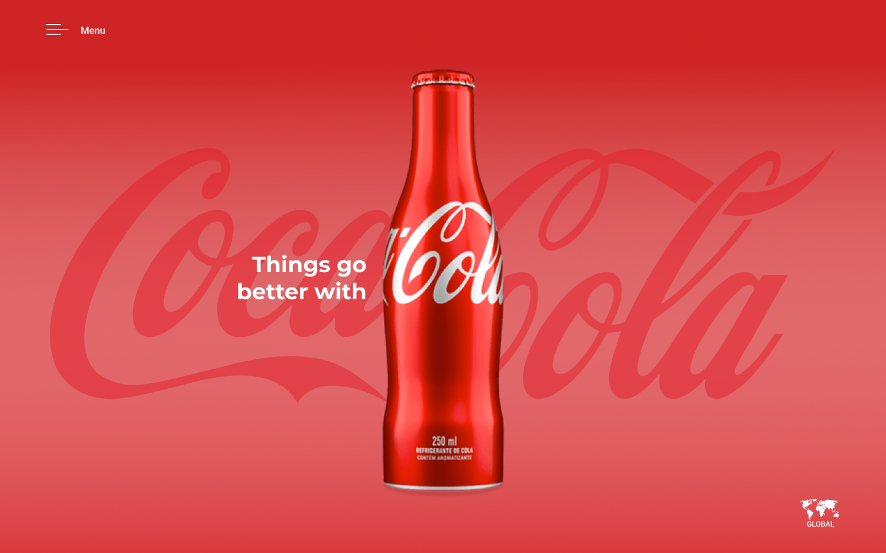

# Projeto Coca‑Cola — Passo a passo (aprendizado)



## 1. Criar um repositório no GitHub

1. Acesse https://github.com/ e faça login.
2. Clique em **New repository**.
3. Informe um nome (ex: `coca-cola`).
4. Clique em **Create repository**.

---

## 2. Criar a pasta do projeto localmente

```bash
cd /caminho/para/projetos
mkdir coca-cola
cd coca-cola
code .  # opcional, para abrir no VS Code
```

---

## 3. Inicializar o Git e vincular ao GitHub

```bash
echo "meu primeiro commit" >> README.md
git init
git branch -M main
git remote add origin https://github.com/SEU-USUARIO/coca-cola.git
git push -u origin main
```

---

## 4. Criar o `index.html` (estrutura básica)

Crie o arquivo `index.html` com o conteúdo mínimo:

```html
<!DOCTYPE html>
<html lang="pt-BR">
<head>
  <meta charset="UTF-8">
  <meta http-equiv="X-UA-Compatible" content="IE=edge">
  <meta name="viewport" content="width=device-width, initial-scale=1.0">
  <link rel="stylesheet" href="./style.css">
  <title>Coca‑cola</title>
</head>
<body>

</body>
</html>
```

Envie para o GitHub:

```bash
git add .
git commit -m "estrutura básica"
git push
```

---

## 5. Criar `style.css` com reset

Crie o arquivo `style.css` e adicione:

```css
*{
  margin: 0;
  padding: 0;
  box-sizing: border-box;
}
```

Commit e push:

```bash
git add .
git commit -m "reset"
git push
```

---

## 6. Estilizar o `body` com background gradiente

No `style.css` adicione:

```css
body{
  display: flex;
  flex-direction: column;
  width: 100vw;
  height: 100vh;
  background: linear-gradient(#CF2425,#DA6062 50%,#DA6062 60%,#DA3B3F);
}
```

Commit e push:

```bash
git add .
git commit -m "background gradiente no body"
git push
```

---

## 7. Criar estrutura HTML com imagens, header, main e footer

No `index.html`, dentro de `<body>`:

```html


<header>
  <nav>
    
    <span class="menu-text">MENU</span>
  </nav>
</header>

<main>
  <h2 class="content-text">Things go better with</h2>
  
</main>

<footer>
  
</footer>
```

Commit e push:

```bash
git add .
git commit -m "estrutura com imagens, header, main e footer"
git push
```
<aside>
💡

Crie uma pasta chamada **img** e adicione as imagens abaixo:

[https://fernandoleonid.github.io/coca-cola-2023/img/menu-burger.svg](https://fernandoleonid.github.io/coca-cola-2023/img/menu-burger.svg)

[https://fernandoleonid.github.io/coca-cola-2023/img/map.svg](https://fernandoleonid.github.io/coca-cola-2023/img/map.svg)

[https://fernandoleonid.github.io/coca-cola-2023/img/background-image.png](https://fernandoleonid.github.io/coca-cola-2023/img/background-image.png)

[https://fernandoleonid.github.io/coca-cola-2023/img/coca-cola.png](https://fernandoleonid.github.io/coca-cola-2023/img/coca-cola.png)

</aside>
---

## 8. Estilizar a imagem de fundo (`background-image`)

No `style.css`:

```css
.background-image{
  position: absolute;
  max-width: 100%;
  max-height: 100%;
  top:0; left:0; right:0; bottom:0;
  margin:auto;
  opacity:0.5;
  z-index:-1;
}
```

Commit e push:

```bash
git add .
git commit -m "estiliza background-image"
git push
```

---

## 9. Estilizar o header

```css
header{
  height: 100px;
}
header nav{
  height: 100%;
  display: flex;
  align-items: center;
  gap: 20px;
  color: white;
  margin-left: 75px;
  font-family: sans-serif;
  cursor: pointer;
}
```

Commit e push:

```bash
git add .
git commit -m "estiliza header"
git push
```

---

## 10. Estilizar o main

```css
main{
  flex-grow: 1;
  display: flex;
  justify-content: center;
  align-items: center;
}

.content-text{
  position: absolute;
  color: #FFF;
  font-size: 2.25rem;
  width: 212px;
  transform: translateX(-100%);
  text-align: end;
  margin-right: 24px;
}

.content-image{
  height: 80vh;
  filter: drop-shadow(0px 200px 20px #0006);
}
```

Commit e push:

```bash
git add .
git commit -m "estiliza main"
git push
```

---

## 11. Estilizar o footer

```css
footer{
  height: 100px;
  display: flex;
  justify-content: flex-end;
  align-items: flex-start;
  margin-right: 75px;
}
```

Commit e push:

```bash
git add .
git commit -m "estiliza footer"
git push
```

---

## 12. Criar responsividade

```css
@media (max-width:768px){
  header nav{ 
      margin-left:25px; 
    }
  main{ 
      align-items:flex-end; 
    }
  .content-text{ 
      transform: translateX(0); 
      top:80px; 
      font-size:1rem; 
      width:100px; 
      text-align:center; 
      margin:0; 
    }
  .content-image{ 
      height:70vh; 
    }
  footer{ 
      height:60px; 
      margin-right:25px; 
    }
}
```

Commit e push:

```bash
git add .
git commit -m "responsividade"
git push
```

---

## 13. Habilitar GitHub Pages

1. Vá em **Settings** → **Pages**.
2. Em **Source**, escolha a branch `main` e a pasta `/root`.
3. Salve.

---

## 14. Criar `README.md`

Edite `README.md` com descrição do projeto e lembre que "printar" seu projeto e salvar na pasta img com o nome print.png:

```md
# Coca‑Cola

Landing page de treino com HTML e CSS.

## Tecnologias
- HTML
- CSS
- Media Queries
```

Commit e push:

```bash
git add README.md
git commit -m "adiciona README"
git push
```

